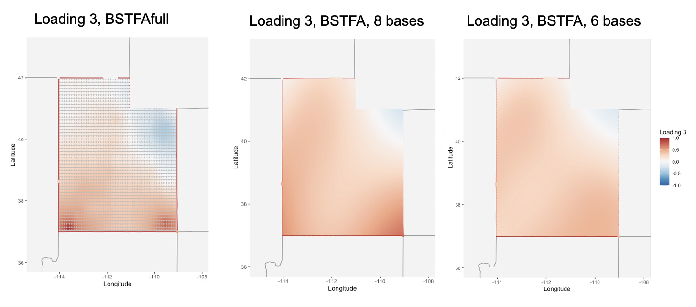
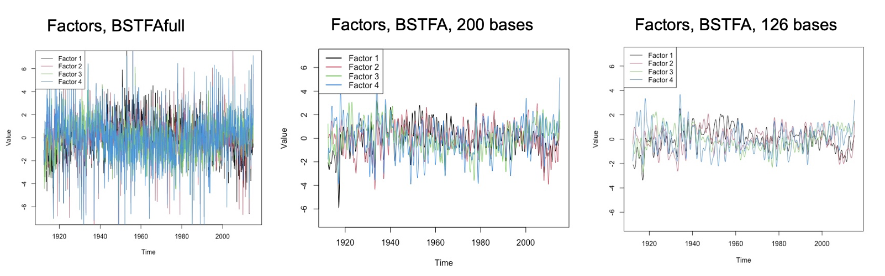
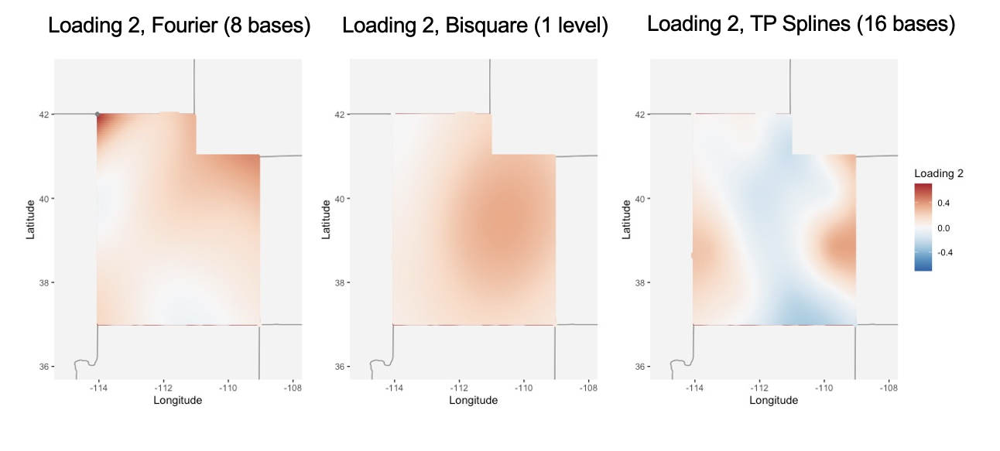

```{r setup1, include = FALSE}
knitr::opts_chunk$set(
  collapse = TRUE,
  comment = "#>",
  cache=FALSE
)
```

```{r setup2, echo=FALSE, include=FALSE}
library(knitr)
devtools::load_all()
library(kableExtra)
```

# Introduction 

## Intended Audience 

This document is intended to help even novice Bayesian statistics students implement a fully Bayesian spatio-temporal analysis. Every function within the package is designed with this audience in mind. This document is meant to guide any potential user of this package through the basic implementation of the models; in essence, it is an instruction manual. The bulk of this document contains examples of our functions applied on an observed data set.

The outline is as follows. First, we introduce the motivation behind the Bayesian spatio-temporal factor analysis models and why simplifying the model for fast computation is important. Section \@ref(sec-implement) outlines the available functions and procedures within the `BSTFA` package along with demonstrations on a real data set. Some basic theory and methodology are contained in Section \@ref(sec-methods), and Section \@ref(sec-features) details specific features of the package. The appendix contains a few helpful additional notes on computation and references.

## Motivation

Consider for example the motivating data for the `BSTFA` package: a collection of temperature measurements across the state of Utah. The data were collected from May 1912 through January 2015 from 146 weather stations across the state. These measurements are 30-day averages of daily minimum observed temperatures in degrees Celcius, with each location's measurements zero-centered. This environmental process exhibits some of the challenges common in environmental modeling; that is, the data show obvious spatial and temporal dependence and not all contributing agents are known or easy to include in a modeling scheme. 

Take, for example, the observations for three weather stations: Moab, Canyonlands National Park, and Logan. The Moab and Canyonlands stations are near one another (within 50 miles) while the Logan station is far away (300 miles). Figure \@ref(fig:fig-utahTemps) shows these same temperature series zoomed in on the years 1999 through 2001. The difference between low temperatures in winter 2000 and winter 2001 is slight in Moab and the Canyonlands, but in Logan, the low temperature is much lower in winter 2001 than it was in winter 2000.  This anecdote illustrates that locations near each other in space exhibit similar environmental behavior. Spatio-temporal factor analysis accounts for such spatio-temporal dependencies and can provide numerical and visual summaries of that dependence. 

Estimation of a fully-parameterized Bayesian spatio-temporal factor analysis model is computationally burdensome. The `BSTFA` package accounts for this by using dimension reduction via basis functions, allowing for faster computation. The remainder of this vignette describes the `BSTFA` package and its use of basis functions, as well as all implemented methods for plotting, prediction, and inference.

```{r fig-utahTemps, echo=FALSE, fig.height=3.5, fig.width=6, fig.cap='Mean-centered 30-day average daily minimum temperatures for three Utah weather stations (Moab, green; Canyonlands, orangee; Logan, purple) from January 1999 through December 2001.', fig.align="center"}

mycols <- RColorBrewer::brewer.pal(8, 'Dark2')
colnames(utahDataList$TemperatureVals) = utahDataList$Locations
window=1050:1090
plot(y=utahDataList$TemperatureVals[window,which(utahDataList$Locations=='MOAB')],
     x=utahDataList$Dates[window], type = 'l',
     main = "Measurements at Three Locations",
     xlab = "",
     ylab = "",
     ylim=c(-18,18),
     cex.main=1, col=mycols[1], lwd=2)
lines(y=utahDataList$TemperatureVals[window,which(utahDataList$Locations=='CANYONLANDS.THE.NECK')],
     x=utahDataList$Dates[window], col=mycols[2], lwd=2)
lines(y=utahDataList$TemperatureVals[window,utahDataList$Locations=='LOGAN.UTAH.ST.UNIV'], 
     x=utahDataList$Dates[window], col=mycols[3], lwd=2)
legend("bottomleft", legend=c("Moab", "Canyonlands", "Logan"), col=mycols[1:3], lty=1, lwd=2, bg="white", cex=.9)
```


# What is Implemented? {#sec-implement}

The `BSTFA` package contains implementation of two versions of a spatio-temporal factor analysis model along with functions for prediction, plotting and visualizing posterior surfaces. The model-fitting functions are defined in Section \@ref(subsec-modelfit), while the methodology associated with these models is described more fully in Section \@ref(sec-methods). The `BSTFA` package's prediction methods are discussed in Section \@ref(subsec-predict), functions for plotting/visualization are described in Section \@ref(subsec-plots), and notes about computational speed are outlined in Section \@ref(subsec-speed). 

While each of these sections describes some arguments to the functions, the best way to understand all available function arguments is to look at the R help documentation.

## Model-Fitting Functions {#subsec-modelfit}

The `BSTFA` package contains two model fitting functions: `BSTFA`, the smoother and computationally-efficient spatio-temporal factor analysis model using basis functions for the factor analysis; and `BSTFAfull`, the fine-grain but slower spatio-temporal factor analysis model using Gaussian processes for the factor analysis. Both functions return a $\textit{list}$ object containing all information required to summarize posterior inference, including all posterior draws from each parameter, matrices containing the basis functions, and information about computation time. Each function has only three required arguments, summarized in Table \@ref(tab:tab-required). Other arguments relating to model fitting and prior parameter values will be discussed more fully in Section \@ref(sec-methods).

```{r tab-required, results='asis', label="tab-required", echo=FALSE}
kable(
  data.frame(
    "Argument" = c("\\texttt{ymat}", "\\texttt{dates}", "\\texttt{coords}"),
    "Description" = c(
      "A matrix of response values. Each row should represent a point in time; each column should represent a specific location. Missing values should be recorded as NA.",
      "A vector of dates of length \\texttt{nrow(ymat)}. The model functions will transform this vector into 'doy' (day of year) using \\texttt{lubridate::yday()}. Thus, this vector must either be a lubridate or string object with year-month-day format.", 
      "A matrix of coordinate values with number of rows equal to \\texttt{ncol(ymat)} and 2 columns; if using longitude/latitude, longitude should be the first column."
    ),
    check.names = FALSE
  ),
  format = 'latex',
  booktabs = TRUE,
  escape = FALSE,
  longtable = FALSE,
  caption = "Required arguments for the \\texttt{BSTFA} and \\texttt{BSTFAfull} functions."
) %>%  
  column_spec(2, width = "4.5in")
```

The `BSTFA` and `BSTFAfull` functions are demonstrated below. Additional Markov-chain Monte Carlo (MCMC) arguments such as `iters`, `thin`, and `burn` have default values, but they can be specified as in any Bayesian model to control the number of posterior draws. Although the `BSTFA` function is much faster than the fully-parameterized `BSTFAfull` function, it is still an MCMC with many parameters and will need many draws to fully represent the posterior distributions.  Except for the model comparison figures (where plots were created outside the vignette), for the sake of keeping the vignette's compile time short, we use output of only 40 saved draws, which is much too few to fully represent the posterior distributions.  Thus, the interpretations provided herein are for illustrative purposes only.  For more information on MCMC and convergence, we refer the reader to other resources, such as @johnson2022bayes for introductory readers or @gelman2013bayesian for more advanced readers.

The `verbose` argument controls whether or not the function prints status updates during sampling. Although the default value for this is `TRUE`, for the sake of this vignette, `verbose` will always be set to `FALSE`. Also, if desired, the function can save output directly to an `.Rdata` file by setting `save.output == TRUE`. This value is set to `FALSE` by default.

The `utahDataList` list object in the `BSTFA` package contains the observed temperature data (`TemperatureVals`), the corresponding dates (`Dates`), the coordinates (`Coords`), and the weather station names (`Locations`).

```{r BSTFAFunction, echo=FALSE, include=FALSE, cache=FALSE}
# This code runs the function and is used for the plotting functions, but isn't shown in the vignette
set.seed(23416)
bstfa.output = BSTFA(ymat=utahDataList$TemperatureVals,
                     dates=utahDataList$Dates,
                     coords=utahDataList$Coords,
                     factors.fixed = c(144,89,129,78), # Specific fixed factor locations for Utah data set
                     iters=50,
                     burn=10,
                     verbose=TRUE,
                     save.output=FALSE)
```

```{r reducedmod, eval=FALSE, cache=FALSE}
bstfa.output = BSTFA(ymat=utahDataList$TemperatureVals,
                     dates=utahDataList$Dates,
                     coords=utahDataList$Coords,
                     verbose=FALSE)
```

```{r fullmod, eval=FALSE}
bstfa_full.output = BSTFAfull(ymat=utahDataList$TemperatureVals,
                         dates=utahDataList$Dates,
                         coords=utahDataList$Coords,
                         verbose=FALSE)
```


### Understanding Output {#subsubsec-output}

The `BSTFA` and `BSTFAfull` functions output a list object. It should be noted that a user can use all functions within the `BSTFA` package without understanding or using the specific output. We provide these additional details for more in-depth analyses and summaries. Most objects contained in the list are self-explanatory. A few, however, warrant further explanation. 

- Each object that is a parameter (i.e., `beta`) is an MCMC object from the `coda` package [@codapackage] with number of rows equal to the number of MCMC draws.

- `time.data` is a matrix with number of rows equal to `iters` and columns indicating the computation time (in seconds) for the given parameter on that given iteration. This is the object used to create the `compute_summary` mentioned in Section \@ref(subsec-speed).

- `y.missing` is a matrix with number of rows equal to the number of missing data points in `ymat` and number of columns equal to the number of MCMC draws. These are posterior draws from relevant distributions of the missing values of `ymat`. If `save.missing=FALSE` in the function, this will be `NULL`.

- `model.matrices` stores all basis function matrices and other useful matrices for calculating $Y$ (more details given in Section \@ref(sec-methods)).

  - `newS` is equivalent to $\mathbf{B_\beta} \equiv \mathbf{B}_{\xi_j} \forall j$ and has dimension $n \times b_\beta$. Note that $b_\beta = b_\xi$, and this value is `n.spatial.bases` in the model functions.
  - `linear.Tsub` is $t-\bar{t}$,  a $T \times 1$ vector of values $t-\bar{t}$  $\forall$ $t$.
  - `seasonal.bs.basis` is the $t \times u$ matrix of cubic circular b-spline bases where each row represents $\mathbf{U}(t^*)$ for a given time point $t^*$.
  - `confoundingPmat.prime` is an orthogonal projection matrix $P^{\perp}$ used to prevent confounding between the linear and seasonal components and the factor analysis component. For more information about this component, see @berrett2020.
  - `QT` is the $T \times R_t$ matrix of Fourier basis functions for the temporally-dependent factors.
  - `QS` is the $n \times R_s$ matrix of basis functions used for the spatially-dependent loadings. If `spatial.style == load.style` and `n.spatial.bases == n.load.bases`, this will be equivalent to `newS`.
  
- $\mathbf{Note:}$ Care must be taken in understanding the ordering of `F.tilde` and `Lambda.tilde` (discussed in greater detail in Section \@ref(subsubsec-fa)). Each draw of `F.tilde` (meaning, each column) has dimension $TL \times 1$. This means the first $T$ values correspond to factor one, the next $T$ values correspond to factor two, and so on. However, each draw of `Lambda.tilde` has dimension $Ln \times 1$. This means the first $L$ values correspond to location one, the next $L$ values correspond to location two, and so on. When converting a draw of `F.tilde` into a matrix, setting `byrow=FALSE` provides the appropriate $T \times L$ matrix, while when converting a draw of `Lambda.tilde` into a matrix, setting `byrow=TRUE` provides the appropriate $n \times L$ matrix.

## Prediction {#subsec-predict}

The function `predictBSTFA` takes as its first argument the output from the `BSTFA` or `BSTFAfull` functions. Within the function, posterior samples from relevant parameters are used to generate predictions either for the spatio-temporal processes, $Y(\mathbf{s}, t)$, at observed location $\mathbf{s}$ and time $t$, or for, $Y(\mathbf{s^*}, t)$, at $\textit{unobserved}$ location $\mathbf{s^*}$ and time $t$. The `location` argument takes either a location number (corresponding to the appropriate column of your `ymat` argument) for predicting at an observed location, or a matrix/data frame of coordinate values if predicting at a new location. 

If the argument `type` is set to `"all"`, the function will return draws of $Y(\mathbf{s}, t) \text{ } \forall \text{ } (\mathbf{s},t)$. `type` can also be set to `"mean"`, `"median"`, `"ub"` (upper bound), or `"lb"` (lower bound). The option `pred.int` controls whether the calculated uncertainty is a prediction interval (`pred.int == TRUE`; default value) or a credible interval (`pred.int == FALSE`).

The code below provides posterior predictive draws of temperatures at an observed location, "Alpine, Utah". Since `type == "all"`, the function will return a $T \times d$ matrix of posterior draws of $Y(\mathbf{s}, t) \text{ } \forall \text{ } t$ with $d$ being the number of MCMC draws. Each column represents one draw of the $T \times 1$ vector, $\mathbf{Y}$.

```{r predall, eval=F}
loc = 1 # Alpine, Utah in our data set
preds = predictBSTFA(bstfa.output, 
                     location = loc,
                     type='all',
                     pred.int=TRUE,
                     ci.level=c(0.025,0.975))
```

The code below sets `type == "mean"` and returns a $T \times 1$ vector containing the posterior $\textit{mean}$ of $Y(\mathbf{s}, t) \text{ } \forall \text{ } t$.

```{r plotpredobs, eval=F}
loc = 1 # Alpine, Utah in our data set
preds = predictBSTFA(bstfa.output, 
                     location = loc,
                     type='mean')
```

The code below provides posterior predictive draws for temperatures at an $\textit{unobserved}$ location by setting the `location` argument to a data frame of coordinate values. In this case, we consider a city without a monitor, Torrey, Utah, with longitude 111.41$^\circ$ W and latitude 38.29$^\circ$ N.

```{r plotpred, eval=F}
loc = data.frame('Longitude' = 111.41, 'Latitude' = 38.29) # Torrey, Utah
preds_new = predictBSTFA(bstfa.output, 
                         location = loc,
                         type='all',
                         pred.int=TRUE,
                         ci.level=c(0.025,0.975))
```

The `predictBSTFA` function is also called within the `plot_location` function, which takes similar arguments as `predictBSTFA` with the addition of a few extra plotting arguments. `xrange` defines the time points $\{t: t \in \mathcal{T}\}$ at which the posterior estimates are plotted, with default value `NULL` indicating to plot on all of $\mathcal{T}$. `truth` (default value `FALSE`) will plot the observed data along with the estimates if `location` comes from the data set. `uncertainty` (default value `TRUE`) indicates whether to include a posterior predictive interval (`pred.int==TRUE`) or a credible interval (`pred.int==FALSE`).

Below is an example of code used to plot the posterior mean temperature values (black line) at an observed location, "Alpine, Utah," with 95\% posterior predictive bounds (gray bands), and observed measurements (gray circles). Figure \@ref(fig:fig-location) provides the plot.

```{r fig-location, fig.cap="Posterior mean temperature values (black line) at an in-sample location, Alpine, Utah, with 95% posterior predictive bounds (gray bands), and observed temperature measurements (gray circles).", fig.align="center", fig.height=3.5, fig.width=6.5}
loc = 1 # Alpine, Utah in our data set
plot_location(bstfa.output,
              location=loc,
              type='mean',
              pred.int=TRUE,
              uncertainty=TRUE,
              ci.level=c(0.025,0.975),
              xrange=c('1959-01-01', '1979-01-01'),
              truth=TRUE)
```

Below is an example of code used to plot the estimated posterior mean temperature values at an $\textit{unobserved}$ location, "Torrey, Utah". Figure \@ref(fig:fig-prediction) provides the plot where again, the black line represents the posterior mean and the gray bands represent the 95\% posterior predictive intervals.  

```{r fig-prediction, fig.cap="Posterior mean temperature values (black line) at an out-of-sample location, Torrey, Utah, with 95% posterior predictive bounds (gray bands).", fig.align="center",fig.height=4, fig.width=6.5}
loc = data.frame('Longitude' = 111.41, 'Latitude' = 38.29) # Torrey, Utah
plot_location(bstfa.output,
              location=loc,
              type='mean',
              pred.int=TRUE,
              uncertainty=TRUE,
              ci.level=c(0.025,0.975),
              xrange=c('1959-01-01', '1979-01-01'),
              truth=FALSE)
```


## Visualization {#subsec-plots}

The `BSTFA` package contains multiple functions for plotting and visualizing the model output. Of course, all of these can be implemented on your own (the output from the `BSTFA` or `BSTFAfull` functions contain all posterior draws and basis function matrices), but these functions exist for quick plotting and visualization of posterior distributions. Some functions use base R for plotting while others use the `ggplot2` package [@wickham2016]. Table \@ref(tab:tab-plotting) below displays a table with each plotting function and a basic description. 


```{r tab-plotting, results='asis', label="tab-plotting", echo=FALSE}
kable(
  data.frame(
    "Function" = c("\\texttt{plot\\_location}", "\\texttt{plot\\_annual}", "\\texttt{plot\\_spatial\\_param}", "\\texttt{map\\_spatial\\_param}", "\\texttt{plot\\_factor}"),
    "Description" = c(
      "Plot predicted response variable at a specific location (either observed or unobserved) for a specified time range. Credible or prediction interval bands for a given probability (default is 95\\%) can be included. Uses base R for plotting.",
      "Plot the estimated annual seasonal behavior at a specific location (either observed or unobserved). Credible interval bands for a given probability (default is 95\\%) can be included. Uses base R for plotting.", 
      "Plot the estimated spatially-dependent linear slope or specific factor loading (the user specifies the parameter of interest) at all observed locations. Credible interval bounds for a given probability (default is 95\\%) can also be plotted. Uses \\texttt{ggplot2} for plotting.", 
      "Plot the interpolated spatially-dependent linear slope or specific factor loading (the user specifies the parameter of interest) on a grid of unobserved locations. Credible interval bounds for a given probability (default is 95\\%) can also be plotted. Contains arguments to import and plot the grid on a map using functions from the \\texttt{sf} package. Uses \\texttt{ggplot2} for plotting.", 
      "Plot the estimated factors, either individually or all together. Credible interval bands for a given probability (default is 95\\%) can be included. Uses base R for plotting."
    ),
    check.names = FALSE
  ),
  format = 'latex',
  booktabs = TRUE,
  escape = FALSE,
  longtable = FALSE,
  caption = "Plotting/visualization functions in the \\texttt{BSTFA} package.", 
  linesep = ""
) %>%  
  column_spec(2, width = "4.5in")
```

For instance, `plot_annual` can plot the estimated annual seasonal behavior at any (observed or unobserved) location. The code for doing this for the observed location, Alpine, Utah, is provided below.  Figure \@ref(fig:fig-season) provides the corresponding plot, where the black line is the posterior mean, the gray band is the 95\% credible interval, and the gray dots are the observations plotted on their day of year. This shows the expected seasonal behavior -- that the temperatures tend to increase in the spring/summer months and decrease in the fall/winter months. 

```{r fig-season, fig.cap="Posterior mean annual seasonal behavior (black line) with 95% credible interval (gray band), and observed data (open gray circles) plotted by day of year.", fig.align="center",fig.height=3.5, fig.width=5}
plot_annual(bstfa.output,
            location=1,
            years='one')
```

The `plot_spatial_param` function can plot the posterior mean of the linear slope or factor loadings at all observed locations. The `type` argument (default is `"mean"`, with other options `"median"`, `"ub"`, or `"lb"`) indicates which summary to show. The `parameter` argument can be set either to `"slope"` or `"loading"`. If set to `"slope"`, the argument `yearscale` (default is `TRUE`) controls whether the slope estimates are "per year." If set to `"loading"`, the `loadings` argument indicates which loading to plot. First, we provide an example to plot the estimated linear change in temperature (increase or decrease) across time. Figure \@ref(fig:fig-obsslope) provides the corresponding plot, where the color represents the long-term increasing (positive and red) or decreasing (negative and blue) behavior over the observed time period for the observed locations. Note that the output used in this illustration only contains 40 MCMC draws; thus, the interpretation provided here is for illustrative purposes only.  To interpret this plot, we would say that most locations show an average increase in temperature of between 0 and 0.025 degrees Celcius per year over the observed time period of 1912 to 2015.

```{r fig-obsslope, fig.align="center", fig.cap="Posterior mean linear change in time (slope) of temperatures at observed locations.", fig.width=4, fig.height=4}
plot_spatial_param(bstfa.output,
          type='mean',
          parameter='slope',
          yearscale=TRUE)
```

Next, we provide example code for plotting a particular loading, in this case, the posterior mean loadings for the first factor. Figure \@ref(fig-obsloading1) provides the corresponding plot showing the posterior mean loading values that each location places on the first factor, with the color indicating the strength of the weight (darker colors indicate a stronger weight). The circled red dot shows the location of the fixed factor; in this case, the first factor is fixed at Wendover, Utah.  This means that the loading corresponding to factor 1 for that location was fixed at 1 (and fixed at 0 for all other factors) and the loadings for other locations are estimated given that value. The model accounts for spatial dependence in the loadings so that locations near to Wendover are modeled to have posterior mean loadings closer to one.

```{r fig-obsloading1, fig.cap="Posterior mean estimates of loadings for factor 1 at observed locations.  The circled red dot shows the location of the fixed factor loading.", fig.align="center", fig.width=4.5, fig.height=4}
plot_spatial_param(bstfa.output,
          type='mean',
          parameter='loading',
          loadings=1)
```


The `plot_factor` function plots the estimated temporally-dependent factors either together (setting `together=TRUE`) or separate (setting `together=FALSE` and `factor` to the factor number you want to plot). The example code below plots the first factor, corresponding to the loadings shown in the previous example. Figure \@ref(fig:fig-factorexample2) shows the posterior mean (black line) and 95\% credible intervals (gray band) of the first factor across the observed time period. Notice how this first factor in the 1910's and 1920's tends to have lower values (values < 0).  This means that after accounting for the constant increase/decrease in time and the seasonal cycle, this time period saw lower-than-typical temperatures at locations whose loadings weight positively on this factor.  However, from the 1940's-90's, the factor values are at or above 0, indicating that this period saw typical or higher-than-typical temperatures at locations whose loadings weight positively on this factor. 

```{r fig-factorexample2, fig.cap="Posterior mean (black line) and 95% credible interval (gray band) of the first factor across the observed time period.", fig.align="center", fig.height=3.5, fig.width=6}
plot_factor(bstfa.output,
            together=FALSE,
            include.legend=FALSE,
            factor=1,
            type='mean')
```

To plot the factors together, set `together==TRUE`, as in the example code below. Figure \@ref(fig:fig-factorexample1) provides a plot of all four estimated factors.  These factors capture common behaviors of the temperature measurements across time that weren't explicitly modeled (in contrast to the linear increasing/decreasing and seasonal behaviors that were explicitly modeled).

```{r fig-factorexample1, fig.cap="Posterior mean (solid lines) and 95% credible intervals (light colored bands) for the four estimated factors across the observed time period.", fig.align="center", fig.height=3.5, fig.width=6}
plot_factor(bstfa.output,
            together=TRUE,
            include.legend=TRUE,
            type='mean')
```


The `map_spatial_param` function is similar to `plot_spatial_param`, but the parameter is plotted on a grid of unobserved locations. If `map` is set to `FALSE`, the estimates will appear on a square grid. Setting, `map=TRUE`, `state=TRUE` and `location='utah'` uses the `sf` package [@sfpackage] to import a map of Utah. The `fine` argument indicates the size of the grid; for instance, setting `fine=50` creates a $50 \times 50$ grid of locations to estimate parameter values.  This function is demonstrated below for the estimated linear increase/decrease of temperatures across Utah (once again, setting `yearscale=TRUE` to provide "per year" estimates). Figure \@ref(fig:fig-mapexample1) shows the temperatures tend to be increasing across the state by between $\approx$ 0.01 and 0.02$^{\circ}$ C each year, with locations in the northwest showing a small decrease in temperatures across this time period.

```{r fig-mapexample1, cache=FALSE, warning=FALSE, fig.cap="Posterior mean linear change in temperatures across time for locations across the observed space.", fig.align="center", fig.width=4}
map_spatial_param(bstfa.output,
         parameter='slope',
         yearscale=TRUE,
         type='mean',
         map=TRUE,
         state=TRUE,
         location='utah',
         fine=50)
```


## Speed {#subsec-speed}

As mentioned before, the `BSTFA` package takes advantage of various mathematical and coding shortcuts to speed up computation. Specifically, the package uses sparse matrices, the vec operator, and basis functions to improve speed. The sparse matrices are implemented using the `Matrix` package. The basis functions reduce the number of parameters, thus reducing needed computation. In this section, we illustrate computational improvement over the fully-parameterized model for various number of bases.

The model details are covered in greater detail in Section \@ref(sec-methods), so here we supply a short description as to why `BSTFA` is much faster than `BSTFAfull`. Each function models the spatial and temporal dependence of the factor analysis differently. In `BSTFAfull`, we model the factors using a vector autoregressive model and the factor loadings with an exponential spatial dependence structure as in @berrett2020. This causes three main computational issues:

- The autoregressive step requires looping through all time points, with each point requiring matrix inversion and multiplication. This process can be sped up by making use of C++ within R, but even that takes too long in an MCMC algorithm when $T$ gets remotely large (around 100 time points). 

- Estimating the exponential spatial dependence structure for the loadings requires inversion of large, sometimes dense matrices (of size $n \times n$) in every iteration of the algorithm. 

- Estimating the range parameters in this framework requires the Metropolis-Hastings algorithm which introduces increased computation time and potential inefficiency (e.g., smaller posterior effective sample sizes).

The `BSTFA` function instead fits both the factors and the loadings using basis functions of various forms, as discussed in Section \@ref(sec-methods). This solves the problems mentioned above by:

- Removing the need for a vector autoregressive loop.

- Lowering the dimension of the previously large matrices to invert.

- Introducing conjugacy. The entire model used in the `BSTFA` function is conditionally conjugate, allowing for an efficient Gibbs sampler without needing to use any Metropolis steps.

For reference, Table \@ref(tab:tab-computation) compares the number of seconds per MCMC iteration for the `BSTFA` and `BSTFAfull` functions on simulated data with differing numbers of locations (first column) and bases (indicated by the different columns) for the factor loadings. In each instance, $T = 300$ and for the `BSTFA` function, the number of temporal bases is $R_t = 60$. The computations were carried out on a MacBook Pro (13-inch, 2022) with an Apple M2 chip (8-core CPU, 3.5 GHz) and 8 GB of RAM, running macOS 15.1.1.


```{r tab-computation, results='asis', label="tab-computation", echo=FALSE}
kable(
  data.frame(
    "$n$" = seq(100, 500, by=100),
    "\\texttt{BSTFA}, 8 loading bases" = c(0.016, 0.029, 0.051, 0.082, 0.12), 
    "\\texttt{BSTFA}, 20 loading bases" = c(0.017, 0.031, 0.05, 0.078, 0.119), 
    "\\texttt{BSTFA}, 50 loading bases" = c(0.021, 0.036, 0.056, 0.086, 0.126), 
    "\\texttt{BSTFAfull}" = c(.481, 1.292, 1.693, 2.7, 4.186),
    check.names = FALSE
  ),
  format = 'latex',
  booktabs = TRUE,
  escape = FALSE,
  longtable = FALSE,
  caption = "Computation time in seconds per MCMC iteration for simulated data with $n$ locations (first column) and $T=300$ time points fit with the \\texttt{BSTFA} function for different number of Fourier bases for the loadings (8, 20, and 50, indicated by the 2nd, 3rd, and 4th columns) all with $R_t = 60$ Fourier bases for the factors, compared to the \\texttt{BSTFAfull} function (last column).",
  linesep = ""
)
```


Figures \@ref(fig:fig-load3) and \@ref(fig:fig-factor2) illustrate that there is a tradeoff between computation speed and smoothness; that is, computation time is reduced at the cost of over-smoothing. The `BSTFAfull` returns fine-grain estimates with a high computational burden, while `BSTFA` provides a smooth representation of the process in a fraction of the time. Figure \@ref(fig:fig-load3) compares the estimates for the third loading from both the `BSTFAfull` (left) and `BSTFA` functions with 8 (center) and 6 (right) spatial bases on the loadings. The loading plot for `BSTFAfull` was fit with `fine=50` to save on computation time while the two `BSTFA` loading plots were fit with `fine=100`. Figure \@ref(fig:fig-factor2) compares the factor estimates from `BSTFAfull` (left) and `BSTFA` with 200 (center) and 126 (right) temporal bases on the factors. For both the loadings and the factors, the estimates computed by `BSTFAfull` and `BSTFA` display similar patterns, but the computationally-efficient `BSTFA` estimates are smoother spatially and temporally.

```{r fig-load3, fig.cap="Comparison of estimated loadings for factor 3 using BSTFAfull (left), BSTFA with 8 spatial bases (center), and BSTFA with 6 spatial bases (right).", out.width="6.5in", echo=F, fig.align="center"}

```

```{r fig-factor2, fig.cap="Comparison of estimated factors for factor 2 using BSTFAfull (left), BSTFA with 200 temporal bases (center), and BSTFA with 126 bases (right).", out.width="6.5in", echo=F, fig.align="center"}

```

The `BSTFA` package contains a function `compute_summary` that takes as an argument the object from `BSTFA` or `BSTFAfull` and prints a detailed summary of computation time.

```{r comptime}
compute_summary(bstfa.output)
```

# Methodology {#sec-methods}

This section details the methodology implemented in the `BSTFA` package. Specifically, the processes included in the model, basis function dimension reduction techniques, and details about spatio-temporal factor analysis are all discussed. 

## Model

The `BSTFA` package implements a Bayesian spatio-temporal factor analysis regression model. Our model follows the structure proposed by @berrett2020; namely, for a location $\mathbf{s} \in \mathcal{D}$ and a time index $t \in \mathcal{T}$, let $Y(\mathbf{s}, t)$ be the response variable such that
$$
Y(\mathbf{s}, t) = \mu(\mathbf{s}) + (t - \bar{t})\beta(\mathbf{s}) + g(\mathbf{\xi}(\mathbf{s}), t) + \mathbf{f}'(t)\mathbf{\lambda}(\mathbf{s}) + \epsilon(\mathbf{s}, t)
$$
where $\mu(\mathbf{s})$ represents the location-specific mean, $t-\bar{t}$ represents the time $t$ centered by average time over the period of interest, $\beta(\mathbf{s})$ represents a spatially dependent linear slope in time, $g(\mathbf{\xi}(\mathbf{s}), t)$ represents a spatially dependent seasonal periodic process,  $\mathbf{f}'(t)\mathbf{\lambda}(\mathbf{s})$ is a spatio-temporal confirmatory factor analysis (CFA) process, and $\epsilon(\mathbf{s}, t)$ is a zero-mean independent Gaussian residual process with variance $\sigma^2$.  Note that both `BSTFA` and `BSTFAfull` assume the data are zero-centered and sets $\mu(\mathbf{s}) = 0$ for all $\mathbf{s}$ by default.

The approach described in @berrett2020 is implemented in the `BSTFAfull` function. However, as discussed before, the `BSTFA` function makes adjustments to the factor analysis component $\mathbf{f}'(t)\mathbf{\lambda}(\mathbf{s})$ for increased computational speed. We provide a brief overview of the model for each interpretable process here, but for details, we refer the reader to @berrett2020.

### Linear Component

The linear changes across time, $\beta(\mathbf{s})$, are allowed to vary spatially by using spatial basis functions.  Let $\boldsymbol{\beta} = (\beta(\mathbf{s}_1), \dots, \beta(\mathbf{s}_n))'$ be the $n \times 1$ vector of coefficients for the locations of interest.  We model 
$$
\boldsymbol{\beta} \sim N(\mathbf{B_\beta} \boldsymbol{\alpha_\beta}, \tau^2_\beta \mathbf{I}), 
$$
where $\mathbf{B_\beta}$ is an $n \times b_\beta$ matrix of basis functions evaluated at each location, $\boldsymbol{\alpha}_\beta$ represents the corresponding $b_\beta \times 1$ vector of coefficients, $\tau^2_\beta$ represents the variances, and $\mathbf{I}$ the appropriate identity matrix.  We place conjugate priors on $\boldsymbol{\alpha}_\beta$,

$$
\boldsymbol{\alpha}_\beta \sim N(0, \mathbf{A}^{-1}) \\
$$
where $\mathbf{A}$ is a diagonal precision matrix, and $\tau^2_\beta$,

$$
\frac{1}{\tau^2_\beta} \sim \mbox{Gamma}(\gamma, \phi),
$$
where $\phi$ is the rate parameter of the gamma distribution. Table \@ref(tab:tab-linear) provides a list of the arguments to the `BSTFA` and `BSTFAfull` functions that are associated with the linear component.

```{r tab-linear, results='asis', label="tab-linear", echo=FALSE}
kable(
  data.frame(
    "Argument" = c("\\texttt{linear}", "\\texttt{beta}", "\\texttt{alpha.prec}", "\\texttt{tau2.gamma}", "\\texttt{tau2.phi}"),
    "Default Value" = c("\\texttt{TRUE}", "\\texttt{NULL}", "\\texttt{1e-5}", "\\texttt{2}", "\\texttt{1e-6}"),
    "Description" = c(
      "TRUE/FALSE value indicating whether the linear component is included in the model.",
      "Vector of starting values for $\\boldsymbol{\\beta}$ of length $n \\times 1$; if none is supplied, realistic starting values are calculated.",
      "Value on the diagonal of the precision matrix $\\mathbf{A}$.",
      "Value of the shape parameter, $\\gamma$, for the prior of the variance, $\\tau^2_\\beta$.",
      "Value of the rate parameter, $\\phi$, for the prior of the variance, $\\tau^2_\\beta$."
    ),
    check.names = FALSE
  ),
  format = 'latex',
  booktabs = TRUE,
  escape = FALSE,
  longtable = FALSE,
  caption = "Arguments to \\texttt{BSTFA} and \\texttt{BSTFAfull} associated with the linear component."
) %>%  
  column_spec(3, width = "4in")
```

### Seasonal Component

Similarly, the spatially-dependent seasonal periodic process also uses basis functions.  First, we use cubic circular b-splines [@wood2017generalized] in time on the day of the year to model the periodic seasonal component. Let 

$$
g(\boldsymbol{\xi}(\mathbf{s}), t) = \mathbf{U}(t^*) \boldsymbol{\xi}(\mathbf{s}),
$$

where $\mathbf{U}(t^*)$ is the $u \times 1$ vector of cubic circular B-splines evaluated at the day of year of time $t$, denoted by $t^*$, and $\boldsymbol{\xi}(\mathbf{s})$ the corresponding $u \times 1$ vector of coefficients.  We then model the coefficients using the same approach used for the linear slopes.  Namely, let $\boldsymbol{\xi}_j = (\boldsymbol{\xi}_j(\mathbf{s}_1), \dots, \boldsymbol{\xi}_j(\mathbf{s}_n))'$ represent the coefficients for the $j$th spline for all locations of interest. Then,
$$
\boldsymbol{\xi}_j \sim N(\mathbf{B}_{\xi_j} \boldsymbol{\alpha}_{\xi_j}, \tau^2_{\xi_j} \mathbf{I}), 
$$
where $\mathbf{B}_{\xi_j}$ is an $n \times b_{\xi_j}$ matrix of basis functions evaluated at each location, $\boldsymbol{\alpha}_{\xi_j}$ represents the corresponding $b_{\xi_j} \times 1$ vector of coefficients, $\tau^2_{\xi_j}$ represents the variance, and $\mathbf{I}$ the appropriate identity matrix. Each $\boldsymbol{\alpha}_{\xi_j}$ and $\tau^2_{\xi_j}$ are modeled with the same prior distributions (and same hyperparameters) as $\boldsymbol{\alpha}_\beta$ and $\tau^2_\beta$. Table \@ref(tab:tab-seasonal) provides a list of the arguments to the `BSTFA` and `BSTFAfull` functions that are associated with the seasonal component.

```{r tab-seasonal, results='asis', label="tab-seasonal", echo=FALSE}
kable(
  data.frame(
    "Argument" = c("\\texttt{seasonal}", "\\texttt{xi}", "\\texttt{n.seasn.knots}"),
    "Default Value" = c("\\texttt{TRUE}", "\\texttt{NULL}", "\\texttt{7}"),
    "Description" = c(
      "TRUE/FALSE value indicating whether the seasonal component should be included in the model.",
      "Vector of starting values for $\\boldsymbol{\\xi}$ of length $un \\times 1$; if none is supplied, realistic starting values are calculated.",
      "Value representing the value of $u$, the number of circular B-spline knots."),
    check.names = FALSE
  ),
  format = 'latex',
  booktabs = TRUE,
  escape = FALSE,
  longtable = FALSE,
  caption = "Arguments to \\texttt{BSTFA} and \\texttt{BSTFAfull} associated with the seasonal component."
) %>%  
  column_spec(3, width = "4in")
```

### Factor Analysis Component {#subsubsec-fa}

`BSTFAfull` uses a vector autoregressive model on the factors and an exponential Gaussian process model on the loadings. 

Let $L$ represents the number of factors so that $\mathbf{f}(t)$ is an $L \times 1$ vector of factors (a.k.a. scores) at time $t$ and $\boldsymbol{\lambda}(\mathbf{s})$ is an $L \times 1$ vector of loadings for each factor at location $\mathbf{s}$. Define $\mathbf{F} = [\mathbf{f}(1)\, \cdots \,\mathbf{f}(T)]'$ to be the $T \times L$ matrix for all $L$ factors and $T$ times of interest and $\mathbf{\Lambda} = [\boldsymbol{\lambda}(\mathbf{s}_1)\, \cdots \, \boldsymbol{\lambda}(\mathbf{s}_n)]$ to be the $L \times n$ loading matrix for all $n$ locations of interest. As required for identifiability by CFA, given $L$ number of factors, we fix the values for the loadings for $L$ locations with an $L$-rank matrix of constants [@rencher2012]. Table \@ref(tab:tab-factorcomp) provides a list of the arguments to the `BSTFA` and `BSTFAfull` functions that are associated with the factor analysis component.


```{r tab-factorcomp, results='asis', label="tab-factorcomp", echo=FALSE}
kable(
  data.frame(
    "Argument" = c("\\texttt{factors}", "\\texttt{Fmat}", "\\texttt{Lambda}", "\\texttt{factors.fixed}", "\\texttt{n.factors}", "\\texttt{plot.factors}"),
    "Default Value" = c("\\texttt{TRUE}", "\\texttt{NULL}", "\\texttt{NULL}", "\\texttt{NULL}", "\\texttt{min(4, ceiling(ncol(ymat)/20))}", "\\texttt{FALSE}"),
    "Description" = c(
      "TRUE/FALSE value indicating whether the factor analysis component should be included in the model.",
      "Matrix of starting values for $\\mathbf{F}$ of dimension $T \\times L$; if none is supplied, realistic starting values are calculated.",
      "Matrix of starting values for $\\boldsymbol{\\Lambda}$ of dimension $n \\times L$; if none is supplied, realistic starting values are calculated.", 
      "Vector of indices (representing specific columns of \\texttt{ymat}) indicating locations to fix for the factors. If no vector is supplied, fixed factor locations are optimally chosen according to distance and amount of non-missing data. If this vector is supplied, \\texttt{n.factors = length(factors.fixed)}.", 
      "Number of factors to fit. If the number of locations is greater than 80, the function will always fit 4 factors unless otherwise specified in the \\texttt{factors.fixed} argument.",
      "TRUE/FALSE value indicating whether to provide a base R plot of the fixed factor locations."),
    check.names = FALSE
  ),
  format = 'latex',
  booktabs = TRUE,
  escape = FALSE,
  longtable = FALSE,
  caption = "Arguments to \\texttt{BSTFA} and \\texttt{BSTFAfull} associated with the factor analysis component.",
  linesep = ""
) %>%  
  column_spec(2, width = "1.7in") %>%
  column_spec(3, width="3in")
```


### Residual Component

The variance of the zero-mean independent Gaussian residual process, $\sigma^2$, is modeled with a conjugate prior similar to the other variance components,
$$
\frac{1}{\sigma^2} \sim \mbox{Gamma}(\gamma_\sigma, \phi_\sigma),
$$
where $\phi_\sigma$ is the rate parameter of the gamma distribution. Table \@ref(tab:tab-resid) provides a list of the arguments to the `BSTFA` and `BSTFAfull` functions that are associated with the residual variance.

```{r tab-resid, results='asis', label="tab-resid", echo=FALSE}
kable(
  data.frame(
    "Argument" = c("\\texttt{sig2}", "\\texttt{sig2.gamma}", "\\texttt{sig2.phi}"),
    "Default Value" = c("\\texttt{NULL}", "\\texttt{2}", "\\texttt{1e-5}"),
    "Description" = c(
      "A starting value for $\\sigma^2$; if none is supplied, the starting value will be the variance of the non-missing values of \\texttt{ymat}.",
      "Value of the shape parameter, $\\gamma_\\sigma$, for the prior of the residual variance, $\\sigma^2$.",
      "Value of the rate parameter, $\\phi_\\sigma$, for the prior of the overall residual variance, $\\sigma^2$."
    ),
    check.names = FALSE
  ),
  format = 'latex',
  booktabs = TRUE,
  escape = FALSE,
  longtable = FALSE,
  caption = "Arguments to \\texttt{BSTFA} and \\texttt{BSTFAfull} associated with the residual."
) %>%  
  column_spec(3, width = "4in")
```

## Basis Functions {#subsec-basis}

Basis functions are a projection of a process onto a set of linear combinations of lower-dimension functions [@Cressie2022]. We make use of basis functions to allow for smooth estimates for each process across space and to drastically increase computational speed. For spatial modeling, the `BSTFA` package has three basis function forms built in: Fourier bases, bisquare bases, and thin-plate spline bases. For temporal modeling, only Fourier bases are implemented. Because the Fourier basis function is the default for the `BSTFA` package, that is the only methodology discussed in detail here; for the others, we refer the reader to @cressie2008bisquare for bisquare bases and @nychka2000spatial for thin-plate spline bases.

We use Fourier bases because of their connection to Gaussian processes and their computational flexibility. A Gaussian process can be approximated quite well with orthogonal spectral basis functions [@wikle2002spatial]. One example is to use some number of principal components of the spatial covariance matrix. These spectral basis functions can themselves be represented as a sum of sine and cosine functions [@paciorek2007fourier] reminiscent of a trigonometric Fourier series. Fourier bases, then, can capture the frequencies exhibited in the principal components of the underlying Gaussian process, granting a smooth approximation of the process.

We make use of Fourier basis functions for both spatial and temporal dependence. First, consider the Fourier bases for temporal dependence.  Let $Q^T_r(t)$ and $Q^T_{r+1}(t)$ be the $r^{\text{th}}$ and $(r+1)^{\text{th}}$ columns of the matrix of bases for time $t$ for $r = 1, 3, 5, \dots R_t$.  Then, 

$$
Q^T_r(t) = \sin\left(2\pi \frac{r+1}{2} \frac{t}{f_t}\right),
$$
$$
Q^T_{r+1}(t) = \cos\left(2\pi \frac{r+1}{2} \frac{t}{f_t}\right),
$$
where $f_t$ is the frequency of the Fourier function. 

For the spatial basis functions, we must accommodate the two-dimensional nature of space.  Thus, we multiply the sine and cosine functions for each dimension [@paciorek2007fourier]. Let $Q^S_r(\mathbf{s})$ and $Q^S_{r+1}(\mathbf{s})$ be the $r^{\text{th}}$ and $(r+1)^{\text{th}}$ columns of the matrix of bases evaluated at location $\mathbf{s}$ for $r = 1, 3, 5, \dots R_s$.  Then,

$$
    Q^S_r(\mathbf{s}) = \sin\left(2\pi \frac{r+1}{2} \frac{\mathbf{s}_{[1]}}{f_{\mathbf{s}_{[1]}}}\right)  \times \sin\left(2\pi \frac{r+1}{2} \frac{\mathbf{s}_{[2]}}{f_{\mathbf{s}_{[2]}}}\right),
$$
$$
    Q^S_{r+1}(\mathbf{s}) = \cos\left(2\pi \frac{r+1}{2} \frac{\mathbf{s}_{[1]}}{f_{\mathbf{s}_{[1]}}}\right)  \times \cos\left(2\pi \frac{r+1}{2} \frac{\mathbf{s}_{[2]}}{f_{\mathbf{s}_{[2]}}}\right),
$$
where $\mathbf{s}_{[1]}$ represents the first coordinate of $\mathbf{s}$ (e.g., longitude), and $\mathbf{s}_{[2]}$ the second coordinate (e.g., latitude),  and $f_{\mathbf{s}_{[1]}}$ and $f_{\mathbf{s}_{[2]}}$ are the corresponding frequencies of the Fourier functions.

The `BSTFA` package contains a helper function to visualize spatial Fourier bases over a given set of coordinates. This can be useful when trying to choose the value of the spatial frequencies, $f_{s_{[1]}}$ and $f_{s_{[2]}}$ (`freq.lon` and `freq.lat`) and number of bases ($R_s$ or `n.load.bases`) to include in the model. This function is demonstrated below using the Utah temperature data and corresponding plots are shown in Figure \@ref(fig:fig-fourierplots).

```{r fig-fourierplots, fig.cap="Fourier bases for the two-dimensional space.  Top row represents the sine bases (r = 1, 3, 5; left, center, right, respectively).  Bottom row represents the corresponding cosine bases.", fig.align='center'}
plot_fourier_bases(utahDataList$Coords,
                   R=6,
                   plot.3d=TRUE,
                   freq.lon = 4*diff(range(utahDataList$Coords[,1])),
                   freq.lat = 4*diff(range(utahDataList$Coords[,2])))
```

## Spatio-Temporal Factor Analysis using Basis Functions

We model the factors and loadings using the bases in the following way. Let $\mathbf{\tilde{F}} = \mbox{vec}(\mathbf{F})$, be the vectorized $TL\times 1$ vector of all factors, and $\mathbf{\tilde{\Lambda}} = \mbox{vec}(\mathbf{\Lambda})$ be the vectorized $Ln \times 1$  vector of all loadings.  We model $\mathbf{\tilde{F}}$ and $\mathbf{\tilde{\Lambda}}$ using a similar basis function decomposition used for the coefficients of the other processes described in 2.1.1 and 2.1.2; namely,
$$
    \mathbf{\tilde{F}} = (\mathbf{I}_L \otimes \mathbf{Q^T})\mathbf{\alpha}_F, 
$$
$$
    \mathbf{\tilde{\Lambda}} \sim N\left(( \mathbf{Q^S} \otimes \mathbf{I}_L)\mathbf{\alpha}_{\Lambda}, \tau_{\Lambda}^2 \mathbf{I}_{Ln} \right),
$$
where $\mathbf{Q^T}$ is a $T \times (R_t+1)$ matrix of temporal bases, $\mathbf{Q^S}$ is a $n \times (R_s+1)$ matrix of spatial bases, $\mathbf{I}_L$ is the $L\times L$ identity matrix, $\mathbf{\alpha}_F$ is an $(R_t+1)L\times 1$ vector of coefficients, $\mathbf{\alpha}_\Lambda$ is an $L(R_s+1)\times 1$ vector of coefficients, and $\tau_{\Lambda}^2$ is the residual variance for the loadings.

Both sets of coefficients are modeled \emph{a priori} in the same way as $\mathbf{\alpha}_\beta$ and $\mathbf{\alpha}_{\xi_j}$, namely,
$$
    \mathbf{\alpha}_F \sim N(\mathbf{0}, \mathbf{A}_{\alpha_{F}}^{-1}), 
$$
$$
    \mathbf{\alpha}_\Lambda \sim N(\mathbf{0}, \mathbf{A}_{\alpha_{\Lambda}}^{-1}),
$$ 
and the variance component for the loadings $\tau_{\Lambda}^2$ the same as $\tau_{\beta}^2$ and $\tau_{\xi_j}^2$,
$$
\frac{1}{\tau_{\Lambda}^2} \sim \mbox{Gamma}(\gamma, \phi).
$$
Once again, the hyperparameters for the variance take the same argument values as used in the linear and seasonal components. Table \@ref(tab:tab-bases) provides a list of the arguments to the `BSTFA` and `BSTFAfull` functions that are associated the with basis functions.

```{r tab-bases, results='asis', label="tab-bases", echo=FALSE}
kable(
  data.frame(
    "Argument" = c("\\texttt{spatial.style}", "\\texttt{n.spatial.bases}", "\\texttt{load.style}", "\\texttt{n.load.bases}", "\\texttt{freq.lon}", "\\texttt{freq.lat}", "\\texttt{n.temp.bases}", "\\texttt{freq.temp}", "\\texttt{knot.levels}", "\\texttt{max.knot.dist}", "\\texttt{premade.knots}", "\\texttt{plot.knots}"),
    "Default Value" = c("\\texttt{'fourier'}", "\\texttt{8}", "\\texttt{'fourier'}", "\\texttt{6}", "\\texttt{4*diff(range(coords[,1]))}", "\\texttt{4*diff(range(coords[,2]))}", "\\texttt{floor(n.times/10)}", "\\texttt{n.times}", "\\texttt{2}", "\\texttt{mean(dist(coords))}", "\\texttt{NULL}", "\\texttt{FALSE}"),
    "Description" = c(
      "Indicates which type of basis functions to use for the linear and seasonal components. The default is \\texttt{'fourier'}. Other values accepted are \\texttt{'grid'} (for multiresolution bisquare bases) and \\texttt{'tps'} (for thin-plate splines).",
      "Number of basis functions to use for the linear and seasonal components. For Fourier bases, this value is $R_s$. For bisquare bases, this value is ignored. For thin-plate spline bases, the number of bases is \\texttt{floor(sqrt(n.spatial.bases))\\^2} to create an even grid.", 
      "The same as \\texttt{spatial.style} but for the factor loadings.  This does not have to be the same bases as \\texttt{spatial.style}.", 
      "The same as \\texttt{n.spatial.bases} but for the factor loadings.  This does not have to be the same vvalue as \\texttt{n.spatial.bases}.",
      "Frequency of the Fourier basis function for longitude (or, if using other coordinate system, the first coordinate value). This value is $f_{s_{[1]}}$. Default value is four times the range of the longitude coordinates. If not using Fourier bases, this argument is not used.", 
      "Same as \\texttt{freq.lon} but for latitude (or the second coordinate value).", 
      "Number of Fourier basis functions to use for the temporally-dependent factors. This value is $R_t$. The default value is \\texttt{floor(n.times/10)}.", 
      "Frequency of the Fourier bases functions for the temporally-dependent factors. This value is $f_t$. Default value is $T$ (\\texttt{n.times}).",
      "The number of resolutions when using the bisquare basis functions. If not using bisquare bases, this argument is not used.",
      "The distance beyond which a location is considered 'too far' from a knot, meaning its basis function value associated with that knot evaluates to zero. If not using bisquare bases, this argument is not used.",
      "A list of coordinates containing pre-specified knots. Each element of the list is a resolution. Each resolution should have the same number of columns as \\texttt{coords}. If not using bisquare bases, this argument is not used.",
      "TRUE/FALSE value indicating whether to provide a base R plot of the knot resolutions overlaid on top of the given \\texttt{coords}. If not using bisquare bases, this argument is not used."
    ),
    check.names = FALSE
  ),
  format = 'latex',
  booktabs = TRUE,
  escape = FALSE,
  longtable = FALSE,
  caption = "Arguments to \\texttt{BSTFA} and \\texttt{BSTFAfull} associated with basis functions used for various components of the model.", 
  linesep = ""
) %>%  
  column_spec(3, width = "3in")
```

# Useful Features {#sec-features}

## Fixing Factors

Factor analysis allows for interpretability of the factors and/or loadings. Since loadings are spatially dependent, it makes sense to use a geographic interpretation. Thus, to model the Utah temperature data, we choose locations to fix that will lend factor interpretation to West (Wendover), East (Moab), South (St. George), and North (Logan) factors, shown by the large red dots in Figure \@ref(fig:fig-dataplot). In this instance, with $L = 4$ factors chosen, the $L$-rank matrix of constants is the $L \times L$ identity matrix. This is the matrix for fixed factors used in the `BSTFA` and `BSTFAfull` functions. 

It's important that the fixed factor locations have a low proportion of missing data. If fixed factor locations are not given, they will be smartly chosen by the function according to distance and proportion of missing data.

```{r dataplotsetup, echo=FALSE, warning=FALSE, include=FALSE}
map_data_loc <- ggplot2::map_data('state')[ggplot2::map_data('state')$region == 'utah',]
full_map <- ggplot2::map_data('state')
sf_polygon <- sf::st_sfc(sf::st_polygon(list(as.matrix(map_data_loc[,c(1,2)]))), crs=4326)
fixed_locations <- utahDataList$Coords[c(144,89,129,78),]

m = ggplot() +
  ## First layer: worldwide map
  geom_polygon(data = full_map,
               aes(x=long, y=lat, group = group),
               color = '#9c9c9c', fill = '#f3f3f3') +
  ## Second layer: Country map
  geom_polygon(data = map_data_loc,
               aes(x=long, y=lat, group = group),
               color = 'black', fill='#f3f3f3') +
  coord_map() +
  coord_fixed(1.3,
              xlim = c(min(utahDataList$Coords[,1])-0.5, max(utahDataList$Coords[,1])+0.5),
              ylim = c(min(utahDataList$Coords[,2])-0.5, max(utahDataList$Coords[,2])+0.5)) + 
  geom_point(data=utahDataList$Coords,
             aes(x=Longitude,y=Latitude),
             color='black', cex=1) +
  geom_point(data=fixed_locations,
             aes(x=Longitude,y=Latitude),
             color='red', cex=2.5) + 
  theme(axis.text=element_blank(),
        axis.ticks = element_blank()) + 
  xlab("") + 
  ylab("")
```

```{r fig-dataplot, echo=FALSE, fig.cap="Plot of Utah showing locations of fixed factors (in red) and all locations (in black).", fig.align="center", fig.width=4}
m
```


Because Logan is the fourth fixed loading location (northern-most red dot in Figure \@ref(fig:fig-dataplot)), the estimates for the fourth loading indicate the strength of the relationship of each location's temperatures to Logan's temperatures, after accounting for linear and seasonal processes. Higher loading values indicate greater similarity. Thus, the next code chunks and Figures \@ref(fig:fig-factorexample) and \@ref(fig:fig-mapexample) show the posterior mean estimate of Factor 4 (the common temperature behavior among those locations that have higher loading values), and a map of the loading values on a grid across Utah. This map shows that locations in the northeast have higher loading values and thus will have temperature measurements that behave similarly to that of the fourth factor.

```{r fig-factorexample, fig.cap="Posterior mean (black line) and 95% credible interval (gray band) for the fourth factor.", fig.height=3.5, fig.width=6, fig.align="center"}
plot_factor(bstfa.output,
            together=FALSE,
            include.legend=FALSE,
            factor=4,
            type='mean')
```

```{r fig-mapexample, cache=FALSE, warning=FALSE, fig.cap="Posterior mean estimates across the state of Utah for the fourth loading.", fig.align="center", fig.width=4}
map_spatial_param(bstfa.output,
         parameter='loading',
         loading=4,
         type='mean',
         map=TRUE,
         state=TRUE,
         location='utah',
         fine=50)
```

## Basis Function Details

The choice of basis functions is assigned using the `spatial.style` and `load.style` arguments. The `spatial.style` argument controls which basis functions to use for the linear and seasonal components ($\mathbf{B_\beta}$ and each $\mathbf{B}_{\xi_j}$) while the `load.style` argument controls the basis functions for the factor loadings ($\mathbf{Q^S}$). The number of bases for the linear and seasonal components is specified with the argument `n.spatial.bases` while the loadings use the argument `n.load.bases`. The values given to `spatial.style` and `load.style` need not be the same, nor do `n.spatial.bases` and `n.load.bases`. The default value for both style arguments is `"fourier"`. The only basis functions used for the temporally-dependent factors are Fourier bases.

### Fourier Bases

When using Fourier bases, the user needs to specify number of bases and the spatial frequency in both the longitude and latitude directions. As demonstrated in Section \@ref(subsec-basis), the function `plot_fourier_bases` can help the user visualize Fourier bases and choose the appropriate amount of bases and frequencies. After exploratory analysis methods (demonstrated in Section \@ref(subsubsec-choose)), it seems that assigning `freq.lon` and `freq.lat` values of 40 and 30 respectively and setting `n.spatial.bases` and `n.load.bases` equal to 8 and 6, respectively, works well for the Utah data set.

The user should also consider the frequency (`freq.temp`) and number of bases (`n.temp.bases`) for the temporal factors, which always use Fourier bases. The default values (see Table 2.5) tend to work well, but increasing the number of bases can create a finer estimate at the cost of reduced computational speed.

```{r, eval=FALSE}
out <- BSTFA(ymat=utahDataList$TemperatureVals,
      dates=utahDataList$Dates,
      coords=utahDataList$Coords,
      spatial.style='fourier',
      load.style='fourier',
      n.spatial.bases=8,
      n.load.bases=6,
      freq.lon=40,
      freq.lat=30,
      n.temp.bases=floor(nrow(utahDataList$TemperatureVals)/10),
      freq.temp=nrow(utahDataList$TemperatureVals))
```

### Bisquare Bases

As described in Table 2.5, multiple arguments to `BSTFA` and `BSTFAfull` are used only for bisquare bases. The argument given to `spatial.style` or `load.style` to use these basis functions is `'grid'`. The `knot.levels` argument indicates how many resolutions of knots to create, where the $r^{th}$ resolution uses $2^{2r}$ bases distributed evenly in a square grid across the coordinates of the data. Setting `plot.knots=TRUE` outputs a plot of knots in all resolutions.  Figure \@ref(fig:fig-plottingknots) shows two resolutions of knots and the data locations for the Utah temperature data.

```{r fig-plottingknots, fig.cap="Location of the observed data (open black circles) and the bisquare bases knots for resolution 1 (red dots) and resolution 2 (green dots) for default knot locations.", fig.width=4.5, fig.height=4.5, fig.align="center"}
bstfa.plot_knots = BSTFA(ymat=utahDataList$TemperatureVals,
                         dates=utahDataList$Dates,
                         coords=utahDataList$Coords,
                         spatial.style='grid',
                         load.style='grid',
                         knot.levels=2,
                         plot.knots=TRUE,
                         verbose=FALSE,
                         iters=5)
```

The user can specify custom knot locations with the `premade.knots` argument. This argument takes a list of coordinates containing pre-specified knots. The number of elements in the list represents the number of resolutions. Each element of the list should have the same number of columns as `coords`. Figure \@ref(fig:fig-customknots) an example where the first resolution matches the default, but the second uses a $3 \times 3$ grid of knots rather than the default $4 \times 4$.

```{r fig-customknots, fig.cap="Location of the observed data (open black circles) and the bisquare bases knots for resolution 1 (red dots) and resolution 2 (green dots) for user-defined knots.", fig.width=4.5, fig.height=4.5, fig.align="center"}
knots=list()
max.lon = max(utahDataList$Coords[,1])
min.lon = min(utahDataList$Coords[,1])
max.lat = max(utahDataList$Coords[,2])
min.lat = min(utahDataList$Coords[,2])
range.lon = max.lon-min.lon
range.lat = max.lat-min.lat
knots[[1]] = expand.grid(c(min.lon+(range.lon/4), min.lon+3*(range.lon/4)),
            c(min.lat+(range.lat/4), min.lat+3*(range.lat/4)))
knots[[2]] = expand.grid(c(min.lon+(range.lon/6), 
                           min.lon+(range.lon/2), 
                           min.lon+5*(range.lon/6)),
                         c(min.lat+(range.lat/6), 
                           min.lat+(range.lat/2), 
                           min.lat+5*(range.lat/6)))
bstfa.custom_knots = BSTFA(ymat=utahDataList$TemperatureVals,
                           dates=utahDataList$Dates,
                           coords=utahDataList$Coords,
                           spatial.style='grid',
                           load.style='grid',
                           knot.levels=2,
                           plot.knots=TRUE,
                           premade.knots=knots,
                           verbose=FALSE,
                           iters=5)
```

### Thin-Plate Spline Bases

The argument given to `spatial.style` and `load.style` to use these basis functions is `'tps'`. The function `basis.tps` from the `npreg` package is used to create the thin-plate spline bases. The knots used to create the bases are on a square grid; thus, the number of bases is equal to `floor(sqrt(n.spatial.bases))^2` and `floor(sqrt(n.load.bases))^2`. So, even if the values 8 and 10 are given to `n.spatial.bases` and `n.load.bases` as shown in the code below, the number of bases used in the model will be 4 and 9.

```{r, eval=FALSE}
bstfaTPS <- BSTFA(ymat=utahDataList$TemperatureVals,
      dates=utahDataList$Dates,
      coords=utahDataList$Coords,
      spatial.style='tps',
      load.style='tps',
      n.spatial.bases=8,
      n.load.bases=10)
```

### Choosing Basis Functions {#subsubsec-choose}

There are few ways to decide which spatial basis functions to use for your data. First, diagnostics such as the Watanabe-Akaike Information Criterion (WAIC) and Leave-One-Out Cross-Validation (LOO-CV) can help the user compare model fits [@loopackage]. These can be computed using the `waic` and `loo` functions from the `loo` package. These functions require a matrix of log-likelihood values, which can be generated using the function `computeLogLik` from the `BSTFA` package, supplying as argument the output from `BSTFA` or `BSTFAfull`.

```{r, eval=FALSE}
loglik = computeLogLik(bstfa.output,
                       verbose=FALSE)
loo::waic(loglik)
loo::loo(loglik)
```

Table \@ref(tab:tab-waic) compares the WAIC and LOO-CV for 12 different models fit to the Utah data. In each instance, the number of spatial bases is the same for both the linear/seasonal components and the factor analysis component -- that is, `n.spatial.bases` = `n.load.bases`. The number of temporal bases is the `n.temp.bases` argument; 126 is the default for the Utah data (10\% of $T$). 

```{r tab-waic, results='asis', label="tab-waic", echo=FALSE}
kable(
  data.frame(
    "Type" = rep(rep(c("Fourier", "Bisquare", "TPS"), each=2), 2),
    "\\# of Spatial Bases" = rep(c(8, 16, "4 (1-level)", "20 (2-levels)", 9, 16), 2),
    "\\# of Temporal Bases" = rep(c(126, 200), each=6), 
  "LOO-CV" = c(202.7, 203.2, 203.4, 203.6, "\\textbf{202.6}", 203.2, 204.6, 205.7, 204.7, 203.9, 205.2, 204.8),
  "WAIC" = c(195.8, 195.4, 195.4, 195.3, 195.7, 195.6, 191.6, "\\textbf{191.4}", 191.6, 191.9, 191.7, 191.8),
    check.names = FALSE
  ),
  format = 'latex',
  booktabs = TRUE,
  escape = FALSE,
  longtable = FALSE,
  caption = "Summary of model performance diagnostics, LOO-CV and WAIC, for different basis functions.",
  align="c",
  linesep = ""
)
```

Notice that in this case, the choice of spatial basis function does not matter much, while increasing the number of temporal bases from 126 to 200 leads to a reduction in WAIC, indicating better model fit. However, increasing the number of temporal bases reduces computational efficiency (in this instance, moving from 126 to 200 temporal bases added about 0.2 seconds to each iteration). 

In addition to model diagnostics, it's also important to visually assess estimates using the different basis functions and other settings. For instance, this can be done by fitting a model with each basis function and estimating the linear slope and loadings using `map_spatial_param`, as demonstrated in Section \@ref(subsec-plots). Figure \@ref(fig:fig-basiscompare) shows three estimates of the second loading (based on the "East" factor for fixed loading Moab, Utah) when the loadings are fit with Fourier bases (using default values for frequency), bisquare bases, and thin-plate spline bases. The estimates for the different basis functions look quite different; this is partly because the corresponding estimated factors are different.

```{r fig-basiscompare, fig.cap="Posterior mean estimates of the second loading for different style of spatial bases: Fourier (left), bisquare (center), and thin-plate spline (right).", out.width="6.5in", echo=F}

```

## Assessing MCMC Convergence

The `BSTFA` package has built-in helper functions for assessing convergence. They use the fact that all matrices of parameter draws are MCMC objects from the `coda` package. To look at trace plots, you can use the `plot_trace` function. This function takes as input your `BSTFA` or `BSTFAfull` object, a string value `parameter` indicating which parameter to view (corresponds directly to what the parameter is called in the `BSTFA` list output), and `param.range` which accepts a numeric vector indicating which of these parameters you want to view.

```{r, eval=F}
plot_trace(bstfa.output,
           parameter='beta',
           param.range=c(27),
           density=FALSE)
```

The other available helper function is `convergence_diag`. This function takes as input the `BSTFA` or `BSTFAfull` function output and returns the effective sample size or Geweke diagnostic (indicated by `type='eSS'` or `type='geweke'`) for all parameters above a given cutoff (indicated by `cutoff`). For instance, the function below will return all parameters with an effective sample size below 100.

```{r, eval=FALSE}
convergence_diag(bstfa.output,
                  type='eSS',
                  cutoff = 100)
```


# Appendices

## Computation Notes

Below are specific notes about computation not explicitly mentioned in the vignette:

- The values for `n.spatial.bases`, `n.load.bases` and `n.temp.bases` need to be even numbers. If they are not, the function will add 1 to the supplied value.

- To help with convergence of the residual factor analysis component, the sampler waits to sample $\mathbf{F}$ and $\mathbf{\Lambda}$ until `min(floor(burn/2), 500)`. That is why, for example, the `compute_summary` function divides computation time into "Pre-Factor Analysis" and "Post-Factor Analysis".

## References


